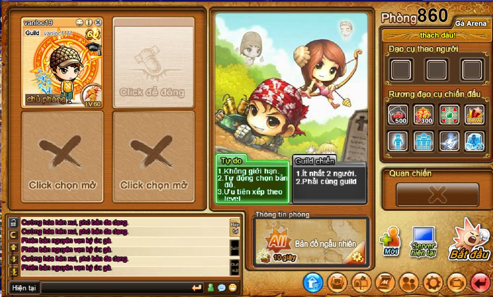
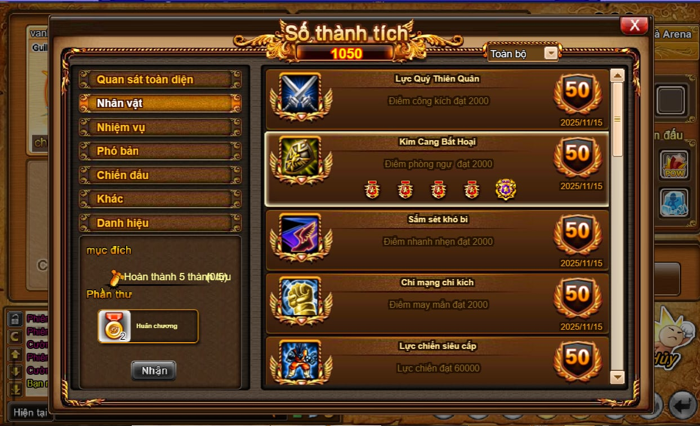
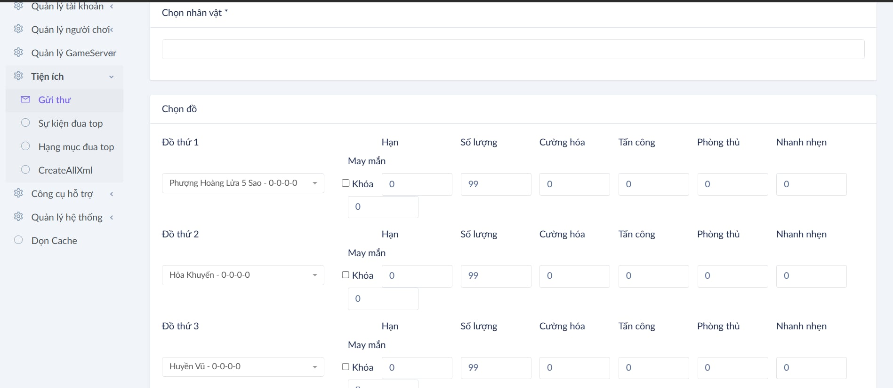

# 🎮 GunnyArena - DDTank 3.0 Full Source Code | Free Open Source Game Server

> **Full Source DDTank 3.0** - Enterprise-grade multiplayer tank battle game platform with microservices architecture. Free open source DD Tank game server code, complete game development framework for creating your own tank battle game.

[](LICENSE)
[](https://dotnet.microsoft.com/)
[](https://laravel.com/)
[](https://nodejs.org/)
[](https://github.com/vanloc19/GunnyArena)
[](https://github.com/vanloc19/GunnyArena)

**GunnyArena** (also known as **DDTank 3.0**, **DD Tank**, **Gunny**, **Tank Battle Game**) is a comprehensive, production-ready game platform featuring a distributed microservices architecture, real-time multiplayer battles, and a complete admin management system. Built with modern technologies including C# .NET, Laravel, Electron, and ActionScript.

🔥 **Free DDTank Source Code** | 📦 **Complete Game Server** | 🎮 **Ready to Deploy** | 🚀 **Multiplayer Tank Game**

---

## 📋 Table of Contents

- [Overview](#-overview)
- [Architecture](#-architecture)
- [Project Structure](#-project-structure)
- [Components](#-components)
- [Getting Started](#-getting-started---how-to-set-up-your-ddtank-server)
- [Submodules](#-submodules)
- [Development](#-development)
- [Documentation](#-documentation)
- [FAQ - Frequently Asked Questions](#-frequently-asked-questions-faq)
- [Contributing](#-contributing)
- [License](#-license)

---

## 🎯 Overview

**GunnyArena** (DDTank 3.0) is a complete full-stack game platform and open source game server code for building your own tank battle game. This repository contains the full source code for DDTank 3.0, a popular multiplayer tank game. The platform consists of three main components:

- **Client**: Flash-based game client (ActionScript) with Electron launcher and Laravel web interface
- **Server**: High-performance C# .NET microservices game server with SQL Server database
- **Admin**: Comprehensive admin panel with ASP.NET MVC and Laravel backend for game management

### Key Features & Capabilities

✅ **Free DDTank Source Code** - Complete open source DD Tank game server
✅ **Full Source Code** - 100% source code included (DDTank 3.0 full source)
✅ **Ready to Deploy** - Production-ready game server code
✅ **Multiplayer Support** - Thousands of concurrent players with real-time PvP/PvE battles
✅ **Complete Game System** - Guild systems, quest progression, item management, shop system
✅ **Admin Panel** - Extensive admin tools for game management
✅ **Modern Architecture** - Microservices architecture with .NET Framework, Laravel, and Electron
✅ **Documentation** - Comprehensive documentation and setup guides

The platform supports real-time multiplayer tank battles, guild systems, quest progression, item management, character progression, PvP battles, PvE modes, and extensive admin tools for managing players, items, and game content.

---

## 🎮 Download Launcher

**Test Account**:
- **Account**: `tovanloc123`
- **Password**: `tovanlocAz@123`

---

## 📸 Screenshots

Check out these screenshots of the DDTank 3.0 game in action:


*DDTank 3.0 Tank Battle Gameplay - Real-time multiplayer combat*


*DDTank 3.0 Character Selection and Customization Screen*


*DDTank 3.0 Game Interface - HUD and Player Stats*


*DDTank 3.0 PvP Battle Mode - Multiplayer Tank Combat*


*DDTank 3.0 Admin Panel - Game Management Interface*

---

## 🏗️ Architecture

```
┌─────────────────────────────────────────────────────────────────┐
│                        GunnyArena Platform                       │
└────────────────────────────┬────────────────────────────────────┘
                             │
        ┌────────────────────┼────────────────────┐
        │                    │                    │
   ┌────▼────┐         ┌─────▼─────┐      ┌─────▼─────┐
   │ Client  │         │  Server   │      │   Admin   │
   │         │         │           │      │           │
   │ • Flash │◄────────┤ • Center  │◄─────┤ • GM      │
   │ • Web   │         │ • Fighting│      │   Service │
   │ • Launch│         │ • Road    │      │ • Website │
   └─────────┘         └─────┬─────┘      └───────────┘
                             │
                    ┌────────▼────────┐
                    │   SQL Database  │
                    └─────────────────┘
```

### Key Features

- **Microservices Architecture**: Scalable, distributed server design
- **Real-time Multiplayer**: Low-latency battle system
- **Cross-platform Client**: Flash game with Electron launcher
- **Comprehensive Admin Tools**: Full game management and monitoring
- **Production Ready**: Battle-tested architecture supporting high concurrency

---

## 📁 Project Structure

```
GunnyArena/
├── Client/              # Client submodule
│   ├── FlashbaseSrc/    # ActionScript game source
│   ├── launcher/        # Electron launcher
│   └── Website/         # Laravel client website
│
├── Server/              # Server submodule
│   ├── GameSrc/         # C# .NET game server source
│   ├── Output/          # Compiled server binaries
│   └── Web/             # Web services and resources
│
├── Admin/               # Admin submodule
│   ├── GM/              # ASP.NET MVC admin service
│   └── Website/         # Laravel admin website
│
├── Database/            # Database backup files
├── Tools/               # Development and deployment tools
├── Docs/                # Project documentation
└── FLA/                 # Flash source files
```

---

## 🧩 Components

### 🎮 Client (Game Client Source Code)

**Repository**: [GunnyClient](https://github.com/vanloc19/GunnyClient)

The DDTank game client contains the complete source code for the Flash-based game client:

- **FlashbaseSrc**: ActionScript 3.0 game client source code (DDTank client full source)
- **Launcher**: Electron-based desktop launcher with auto-update functionality
- **Website**: Laravel web application for player registration, login, and account management

**Technologies**: ActionScript 3.0, Electron, Laravel, Node.js, Flash, Adobe AIR

**Use Cases**: Game client development, Flash game programming, ActionScript learning, game launcher development

### 🖥️ Server (Game Server Source Code)

**Repository**: [GunnyServer](https://github.com/vanloc19/GunnyServer)

The DDTank game server is a high-performance C# .NET microservices architecture:

- **Center Service**: Central server management, authentication, and player session handling
- **Fighting Service**: Real-time battle logic, room management, and PvP/PvE combat system
- **Road Service**: Game progression system, quest management, and level progression
- **Web Services**: RESTful APIs, resource management, and game data endpoints

**Technologies**: C# .NET Framework, ASP.NET, SQL Server, WCF Services

**Use Cases**: Game server development, .NET game programming, multiplayer game architecture, microservices learning

### ⚙️ Admin (Admin Panel & Management Tools)

**Repository**: [GunnyAdmin](https://github.com/vanloc19/GunnyAdmin)

Complete admin panel for managing the DDTank game:

- **GM Service**: ASP.NET MVC admin panel for game master operations, player management, item management
- **Website**: Laravel admin interface with comprehensive tools for game administration

**Technologies**: ASP.NET MVC, Laravel, SQL Server, Bootstrap, jQuery

**Use Cases**: Game administration, GM tools development, admin panel creation, game management system

---

## 🚀 Getting Started - How to Set Up Your DDTank Server

Follow this guide to set up your own DDTank 3.0 game server from source code.

### Prerequisites

Before you begin, ensure you have the following installed:

- **Git** with submodule support (for cloning the repository)
- **.NET Framework** 4.7+ (required for DDTank server and Admin GM service)
- **PHP** 7.4+ and **Composer** (for Laravel websites - client and admin web interfaces)
- **Node.js** 14+ and **npm** (for Electron launcher development)
- **SQL Server** (for DDTank database - game data storage)
- **Flash Builder** or compatible IDE (for ActionScript/Flash client development)
- **Visual Studio** (for C# .NET server development)

### Installation

1. **Clone the repository with submodules:**

```bash
git clone --recursive https://github.com/vanloc19/GunnyArena.git
cd GunnyArena
```

If you've already cloned without `--recursive`, initialize submodules:

```bash
git submodule init
git submodule update
```

2. **Setup Client:**

```bash
cd Client/Website
composer install
cp .env.example .env
php artisan key:generate
```

3. **Setup Server:**

```bash
cd Server/GameSrc
# Open GunArena.sln in Visual Studio
# Restore NuGet packages
# Build solution
```

4. **Setup Admin:**

```bash
cd Admin/Website
composer install
cp .env.example .env
php artisan key:generate
```

5. **Configure Database:**

- Restore database backups from `Database/` folder
- Update connection strings in configuration files

### Quick Start

Use the provided startup scripts:

```bash
# Development mode
start_dev.bat

# Production mode
start.bat
```

---

## 📦 Submodules

This repository uses Git submodules to manage the three main components:

| Submodule | Repository | Description |
|-----------|-----------|-------------|
| **Client** | [GunnyClient](https://github.com/vanloc19/GunnyClient) | Game client, launcher, and web interface |
| **Server** | [GunnyServer](https://github.com/vanloc19/GunnyServer) | Game server microservices |
| **Admin** | [GunnyAdmin](https://github.com/vanloc19/GunnyAdmin) | Admin panel and management tools |

### Working with Submodules

**Update all submodules to latest:**

```bash
git submodule update --remote
```

**Update specific submodule:**

```bash
git submodule update --remote Client
```

**Commit submodule changes:**

```bash
cd Client
git add .
git commit -m "Your commit message"
git push
cd ..
git add Client
git commit -m "Update Client submodule"
```

---

## 💻 Development

### Development Workflow

1. **Create a feature branch:**

```bash
git checkout -b feature/your-feature-name
```

2. **Make changes in respective submodules:**

```bash
cd Client  # or Server, or Admin
# Make your changes
git add .
git commit -m "Add feature X"
git push
```

3. **Update main repository:**

```bash
cd ..
git add Client  # or Server, or Admin
git commit -m "Update Client submodule"
git push
```

### Code Style

- **C#**: Follow Microsoft C# coding conventions
- **PHP**: Follow PSR-12 coding standards
- **JavaScript**: Follow ESLint configuration
- **ActionScript**: Follow Adobe ActionScript style guide

### Testing

Each component has its own testing setup:

- **Server**: Unit tests in `GameSrc/`
- **Client Website**: PHPUnit tests in `Client/Website/tests/`
- **Admin Website**: PHPUnit tests in `Admin/Website/tests/`

---

## 📚 Documentation

Detailed documentation for each component:

- [Client Documentation](Client/README.md)
- [Server Documentation](Server/README.md)
- [Admin Documentation](Admin/README.md)

Additional documentation available in `Docs/` directory.

---

## ❓ Frequently Asked Questions (FAQ)

### What is GunnyArena / DDTank 3.0?

**GunnyArena** is the full source code for DDTank 3.0, a popular multiplayer tank battle game. This repository contains the complete source code including client, server, and admin panel - everything you need to build and run your own DDTank game server.

### Is this free DDTank source code?

Yes! This is free open source DDTank code that you can download, study, and learn from. The source code is provided for educational purposes to help developers understand game development architecture.

### What technologies are used in this DDTank source code?

The DDTank 3.0 source code uses:
- **Client**: ActionScript 3.0 (Flash), Electron, Laravel, Node.js
- **Server**: C# .NET Framework, ASP.NET, SQL Server
- **Admin**: ASP.NET MVC, Laravel, SQL Server

### Can I use this DDTank source code for commercial purposes?

This source code is provided for **educational and learning purposes only**. Commercial use requires explicit permission. Please refer to the License section for full details.

### How do I set up my own DDTank server?

1. Clone this repository with submodules
2. Setup the database (SQL Server)
3. Configure the client, server, and admin components
4. Follow the Getting Started guide above for detailed instructions

### Is this complete DDTank 3.0 full source code?

This repository contains the full source code for the game client, server, and admin panel. Some game resources (images, sounds) and database files may need to be configured separately as they are not included in the repository.

### Can I modify and customize this DDTank code?

Yes, you can study and modify the code for educational purposes. However, redistribution of modified versions requires proper attribution and adherence to the license terms.

### What version of DDTank is this source code?

This is **DDTank 3.0** full source code, also known as Gunny or GunnyArena.

### Do I need programming experience to use this?

Yes, this source code requires knowledge of:
- C# .NET programming (for server)
- ActionScript/Flash (for client)
- PHP/Laravel (for websites)
- SQL Server (for database)
- General software development concepts

### Where can I find DDTank source code documentation?

Each component (Client, Server, Admin) has its own README.md file with detailed documentation. Check the Documentation section above for links.

### Is there support or community for this DDTank source code?

You can contact the developer via the Contact section below, or contribute by opening issues and pull requests on GitHub.

### What makes this different from other DDTank source codes?

This is a production-ready, enterprise-grade implementation with:
- Complete microservices architecture
- Full documentation
- Modern technologies (.NET, Laravel, Electron)
- Active maintenance
- Comprehensive admin tools

---

## 🤝 Contributing

Contributions are welcome! Please follow these steps:

1. Fork the repository
2. Create a feature branch (`git checkout -b feature/amazing-feature`)
3. Commit your changes (`git commit -m 'Add some amazing feature'`)
4. Push to the branch (`git push origin feature/amazing-feature`)
5. Open a Pull Request

### Commit Message Guidelines

- Use clear, descriptive commit messages in English
- Follow conventional commit format when possible
- Reference issue numbers if applicable

---

## 📄 License

**Educational & Learning Purpose - Non-Commercial**

This project is released for **educational and learning purposes only**. The purpose of this release is to help developers learn and understand the project structure and folder organization of the Gunny game platform.

### Terms of Use

- ✅ **Allowed**: Study, learn, and understand the code structure
- ✅ **Allowed**: Use as a reference for educational purposes
- ❌ **Prohibited**: Commercial use without explicit permission
- ❌ **Prohibited**: Redistribution for commercial purposes
- ❌ **Prohibited**: Unauthorized modification and distribution

### Game Resources

- Game resources (images, sounds, assets) are sourced from China
- Resource files are not included in this repository
- All code implementations are original work by the developer

### Important Restrictions

**To prevent abuse and unauthorized sale of source code, the following items are NOT provided:**

- ❌ **Database**: Database files and schemas are not included
- ❌ **Game Resources**: Resource files (images, sounds, assets) are not shared
- ❌ **Complete Source**: Some critical components may be excluded

**Reason**: These restrictions are in place to prevent misuse and unauthorized commercial distribution of the source code. This repository is intended for **educational purposes only** - to help developers understand project structure and architecture, not to provide a complete, runnable system.

**This is a learning resource, not a commercial product.**

### Copyright

**Proprietary - All Rights Reserved**

Copyright © 2024 vanloc19. All rights reserved.

This software and associated documentation files (the "Software") are the proprietary property of vanloc19.

---

## 👥 Team

Developed and maintained by **vanloc19**.

---

## 🔗 Links & Related Resources

### Main Repository Links

- **Client Repository**: [GunnyClient - DDTank Client Source Code](https://github.com/vanloc19/GunnyClient)
- **Server Repository**: [GunnyServer - DDTank Server Source Code](https://github.com/vanloc19/GunnyServer)
- **Admin Repository**: [GunnyAdmin - DDTank Admin Panel](https://github.com/vanloc19/GunnyAdmin)

### Project Website

- **Live Demo**: [gunnyarena.serveirc.com/](https://gunnyarena.serveirc.com/)

### Related Search Terms

Looking for: **DDTank source code** | **DD Tank server code** | **Gunny source code** | **DDTank 3.0 full source** | **Free DDTank code** | **DDTank game development** | **Tank battle game source** | **Open source game server** | **DDTank client source** | **Game server architecture**

---

## 📞 Contact

For questions, suggestions, or inquiries, please contact:

- **Email**: [tovanloc19@gmail.com](mailto:tovanloc19@gmail.com)
- **Facebook**: [vanloc19](https://www.facebook.com/vanloc1963/)

---

**Built with ❤️ for the developer community**

*This project serves as a comprehensive reference for understanding enterprise-level game platform architecture, microservices design, and professional project organization. Whether you're looking for DDTank source code, DD Tank server code, free open source game server, tank battle game development, game server architecture, ActionScript game programming, or .NET game server development - this repository provides a complete learning resource for building your own multiplayer tank game.*

